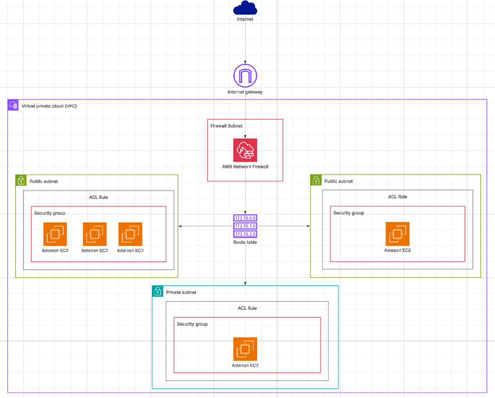

# BastionHost Project

Terraform-based simulation of a Bastion Host (jump server) architecture on AWS.
The goal is to demonstrate how to isolate a private instance so it can only be
reached through a controlled entry point, using NACLs and Security Groups as
layered network controls.

> ⚠️ **Educational use only.** Some configurations (shared SSH key, broad SG rules)
> are intentionally simplified and are **not recommended for production environments**.

---

## Architecture



### VPC — `192.168.0.0/24` (us-west-2)

| Resource | Name    | CIDR             | Type    | Instance |
|----------|---------|------------------|---------|----------|
| Subnet A | subnetA | 192.168.0.0/26   | Public  | Bastion  |
| Subnet B | subnetB | 192.168.0.64/26  | Private | Server_1 |
| Subnet C | subnetC | 192.168.0.128/26 | Public  | Invasor  |

### NACL Rules

| NACL        | Direction | Rule | Action | Target                          |
|-------------|-----------|------|--------|---------------------------------|
| ACL_subnetA | in/out    | 1    | allow  | 0.0.0.0/0                       |
| ACL_subnetB | in/out    | 1    | allow  | 192.168.0.0/26 (subnetA)        |
| ACL_subnetB | in/out    | 2    | deny   | 192.168.0.128/26 (subnetC)      |
| ACL_subnetC | in/out    | 1    | allow  | 0.0.0.0/0                       |

### Security Groups

| Group           | Instances        | Ingress / Egress         |
|-----------------|------------------|--------------------------|
| Bastion-Invasor | Bastion, Invasor | All traffic (0.0.0.0/0)  |
| Server_1        | Server_1         | subnetB only             |

---

## Tech Stack

- **Terraform** >= 1.2 / AWS provider ~> 5.92
- **AWS EC2** — Amazon Linux 2023, t3.micro
- **AWS VPC** — subnets, route tables, internet gateway
- **AWS NACLs** — subnet-level traffic control
- **AWS Security Groups** — instance-level traffic control

---

## Prerequisites

- [Terraform](https://developer.hashicorp.com/terraform/downloads) >= 1.2
- AWS CLI configured with a `default` profile (`aws configure`)
- An SSH key pair at `.ssh/terraform-key` (private) and `.ssh/terraform-key.pub` (public)

Generate the key if you don't have one:
```bash
ssh-keygen -t rsa -b 4096 -f .ssh/terraform-key -N ""
```

---

## Deploy

```bash
terraform init
terraform plan
terraform apply
```

To tear down:
```bash
terraform destroy
```

---

## Testing

### 1. Connect to Bastion (jump server)

```bash
ssh -A -i .ssh/terraform-key ec2-user@<Bastion_Public_IP>
```

### 2. From Bastion, reach Server_1 via private IP

```bash
[ec2-user@bastion ~]$ ssh ec2-user@<Server_1_Private_IP>
```

You should get a successful Amazon Linux 2023 login — the jump is working.

### 3. Verify Invasor is blocked from Server_1

In a separate terminal, connect to Invasor:

```bash
ssh -A -i .ssh/terraform-key ec2-user@<Invasor_Public_IP>
```

Then try to reach Server_1:

```bash
[ec2-user@invasor ~]$ ssh ec2-user@<Server_1_Private_IP>
```

The connection will hang indefinitely — blocked by ACL_subnetB rule 2 (deny from subnetC).
This confirms the network isolation is working correctly.

---

## Roadmap

- [ ] AWS Network Firewall policy
- [ ] VPC_2 with a second Server instance
- [ ] VPC Peering between VPC_1 and VPC_2
- [ ] GitHub Actions pipeline for automated `terraform apply`

---

**LinkedIn:** https://www.linkedin.com/in/theo-panella-b079a4201
